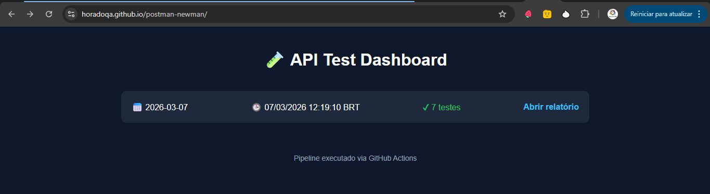
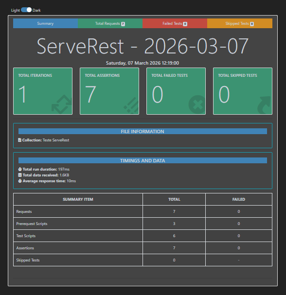

# Testes de API com Postman + Newman + ServeRest

Projeto aplicando testes automatizados de API, integração contínua e geração de relatórios acessíveis online.

---

## 🚀 Tecnologias utilizadas
- **[Postman](https://www.postman.com/)** → Criação e organização das collections de testes.  
- **[Newman](https://www.npmjs.com/package/newman)** → Execução automatizada das collections.  
- **[newman-reporter-htmlextra](https://www.npmjs.com/package/newman-reporter-htmlextra)** → Relatórios HTML detalhados com gráficos de execução.  
- **[ServeRest](https://serverest.dev/)** → API fake simulando backend de e-commerce.  
- **[GitHub Actions](https://docs.github.com/pt/actions)** → Pipeline CI/CD configurado para executar testes automaticamente.  
- **[GitHub Pages](https://pages.github.com/)** → Publicação do dashboard de relatórios diário acessível via web.  

---

## 🗂 Estrutura do projeto

```bash
Teste-Api-ServeRest
┣ 📂 .github/workflows       # Pipeline CI/CD (Newman + Deploy)
┣ 📂 postman                 # Collection de testes (.json)
┣ 📂 reports                 # Relatórios HTML e JSON (gerados no CI)
┣ 📂 site                    # Dashboard público no GitHub Pages
┣ 📜 .gitignore              # Ignora arquivos desnecessários
┣ 📜 README.md               # Documentação do projeto
````

---

## ⚙️ Como funciona o pipeline

1. **Criação de usuário + Login** → Geração de token JWT dinâmico.
2. **Execução da Collection** → Testes em endpoints de `usuarios` e `produtos`.
3. **Geração de Relatórios** → Produz HTML (`htmlextra`) + JSON com métricas de execução.
4. **Publicação Automática** → Deploy do histórico diário no **GitHub Pages**.
5. **Dashboard Moderno** → Cards responsivos mostrando:

   * Data da execução
   * Horário em **BRT**
   * Status PASS/FAIL
   * Número de testes/falhas
   * Link direto para o relatório

---

## 📊 Dashboard e Relatório Online

<p align="center">

</p>

Acesse o histórico de execuções diárias:
**[Dashboard Newman](https://horadoqa.github.io/postman-newman/)**

## O relatório com os testes executados

<p align="center">

</p>

---

## ✅ Testes implementados

* **Usuário**

  * Criar usuário
  * Login com token JWT
  * Listar usuários
* **Produtos**

  * Cadastrar produto
  * Listar produtos
  * Editar produto
  * Excluir produto

---

## 🧑‍💻 Como executar localmente

1. Clone este repositório:

```bash
git clone https://github.com/horadoqa/postman-newman.git
cd postman-newman
```

2. Instale as dependências necessárias:

```bash
npm install -g newman newman-reporter-htmlextra
```

3. Rode a collection manualmente:

```bash
newman run ./postman/TesteApiServeRest.postman_collection.json \
  -r htmlextra \
  --reporter-htmlextra-export ./reports/index.html
```

4. Abra o relatório:

```bash
./reports/index.html
```

---

## ✨ Diferenciais do projeto

* Automação completa sem intervenção manual
* Dashboard moderno, responsivo e acessível online via GitHub Pages
* Histórico diário com até 30 dias de execuções
* Status PASS/FAIL automático, com número de testes e falhas
* Pipeline CI/CD executando automaticamente a cada push ou schedule
* Relatórios detalhados em HTML + métricas em JSON

---

💡 Esse projeto demonstra como transformar testes de API em **um dashboard profissional**, pronto para portfólio de QA/SDET.

---

Perfeito! Podemos adicionar uma seção **Contribuições** clara e profissional no seu README, mostrando como outras pessoas podem colaborar com o projeto.

Aqui está uma sugestão atualizada do README com a seção incluída:

---

## 🤝 Contribuições

Contribuições são sempre bem-vindas! 🙌  

Se você quiser ajudar, siga estas instruções:

1. **Fork** o repositório:
```bash
git clone https://github.com/horadoqa/postman-newman.git
cd postman-newman
````

2. **Crie uma branch** para a sua feature ou correção de bug:

```bash
git checkout -b minha-feature
```

3. **Faça suas alterações** no código ou nas collections do Postman.

4. **Teste localmente** antes de enviar:

```bash
newman run ./postman/TesteApiServeRest.postman_collection.json \
  -r htmlextra \
  --reporter-htmlextra-export ./reports/index.html
```

5. **Commit e push** para a sua branch:

```bash
git add .
git commit -m "Descrição das alterações"
git push origin minha-feature
```

6. **Abra um Pull Request** neste repositório.

   * Descreva claramente suas alterações.
   * Se possível, explique o impacto nos testes e no dashboard.

---

### 💡 Boas práticas para contribuir

* Mantenha o **padrão de nomenclatura** das collections do Postman.
* Teste suas alterações antes de enviar o PR.
* Documente **qualquer novo endpoint ou teste** que adicionar.
* Mantenha o dashboard consistente (não remova relatórios existentes).

---

Agradecemos a sua colaboração! Cada contribuição ajuda a manter o projeto **mais robusto e profissional**. 🚀

